# counter-deploy
Пример проекта для деплоя приложения счетчик на сервер

## Docker Registry Part 1


## Docker registry for Linux Parts 2 & 3

### Попытка сделать пулл без авторизации

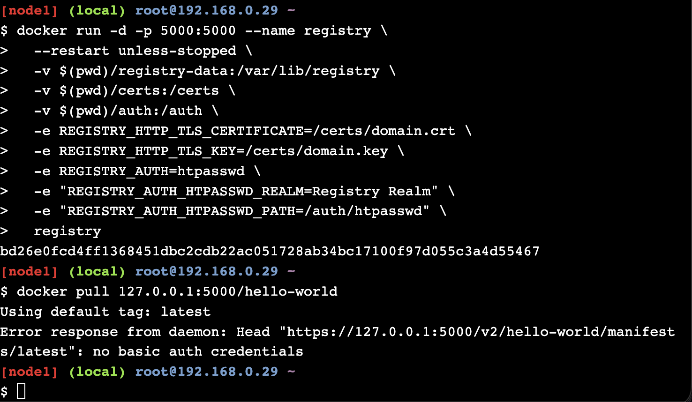

### Заходим под логином и паролем и получаем доступ к репозиторию

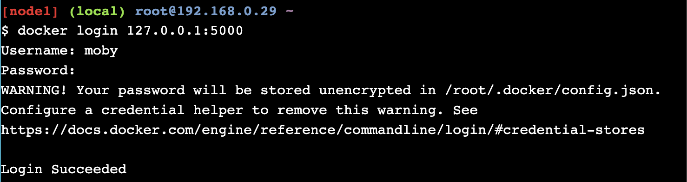

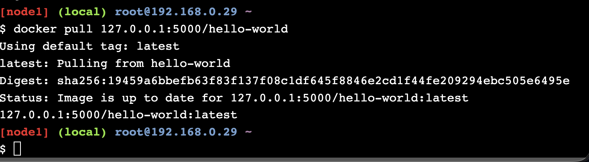

## Docker Orchestration Hands-on Lab

### Узлы в режиме Active

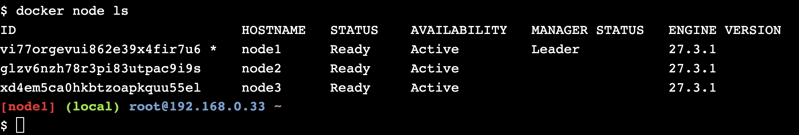

### Node2 в режиме Drain

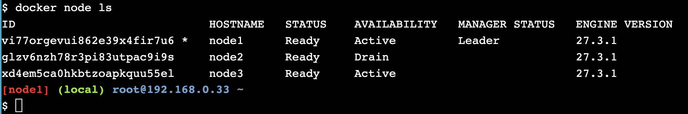

### Inspect Node2

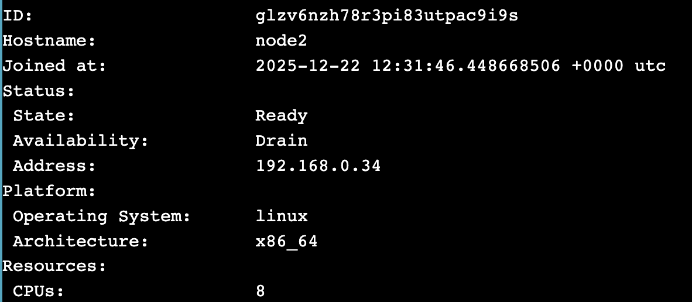
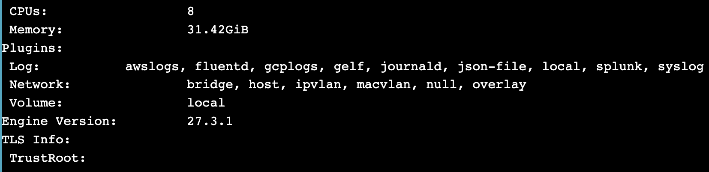

### Видим, что в node2 не запущено никаких контейнеров

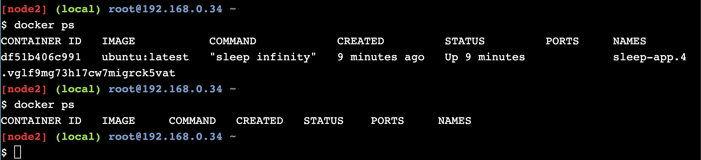
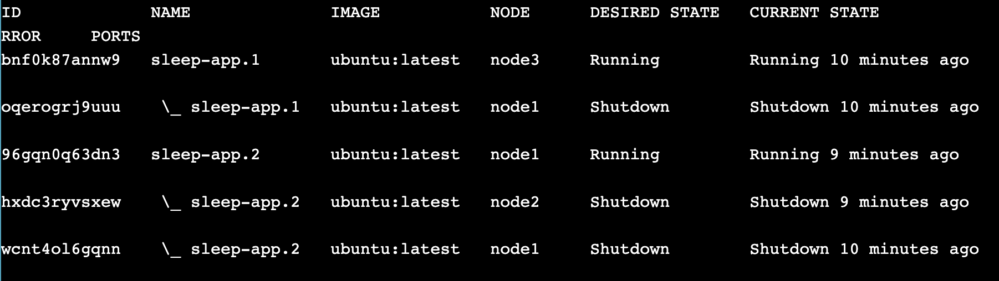

### Восстановилась ли работа запущенного сервиса на этом узле после перевода из Drain в Active?

Нет, автоматически работа сервиса не восстанавливается. При переводе узла в режим Drain Docker Swarm корректно завершает и перераспределяет задачи сервисов на другие доступные узлы кластера. Когда узел возвращают обратно в режим Active, он лишь становится доступным для планировщика, но ранее эвакуированные задачи на него не возвращаются автоматически.

### Что необходимо сделать, чтобы запустить работу службы на этом узле снова?

```docker service update --force sleep-app```
или
```docker service scale sleep-app=N``` где N - количество запущенных контейнеров

## Swarm stack introduction

### Содержимое docker-stack.yml

```
  version: "3.9"

services:

  redis:
    image: redis:alpine
    networks:
      - frontend

  db:
    image: postgres:15-alpine
    environment:
      POSTGRES_USER: "postgres"
      POSTGRES_PASSWORD: "postgres"
    volumes:
      - db-data:/var/lib/postgresql/data
    networks:
      - backend

  vote:
    image: dockersamples/examplevotingapp_vote
    ports:
      - 8080:80
    networks:
      - frontend
    deploy:
      replicas: 2

  result:
    image: dockersamples/examplevotingapp_result
    ports:
      - 8081:80
    networks:
      - backend

  worker:
    image: dockersamples/examplevotingapp_worker
    networks:
      - frontend
      - backend
    deploy:
      replicas: 2

networks:
  frontend:
  backend:

volumes:
  db-data:
```

### Содержимое docker-compose.yml

```
  services:
  vote:
    build:
      context: ./vote
      target: dev
    depends_on:
      redis:
        condition: service_healthy
    healthcheck:
      test: ["CMD", "curl", "-f", "http://localhost"]
      interval: 15s
      timeout: 5s
      retries: 3
      start_period: 10s
    volumes:
     - ./vote:/usr/local/app
    ports:
      - "8080:80"
    networks:
      - front-tier
      - back-tier

  result:
    build: ./result
    # use nodemon rather than node for local dev
    entrypoint: nodemon --inspect=0.0.0.0 server.js
    depends_on:
      db:
        condition: service_healthy
    volumes:
      - ./result:/usr/local/app
    ports:
      - "8081:80"
      - "127.0.0.1:9229:9229"
    networks:
      - front-tier
      - back-tier

  worker:
    build:
      context: ./worker
    depends_on:
      redis:
        condition: service_healthy
      db:
        condition: service_healthy
    networks:
      - back-tier

  redis:
    image: redis:alpine
    volumes:
      - "./healthchecks:/healthchecks"
    healthcheck:
      test: /healthchecks/redis.sh
      interval: "5s"
    networks:
      - back-tier

  db:
    image: postgres:15-alpine
    environment:
      POSTGRES_USER: "postgres"
      POSTGRES_PASSWORD: "postgres"
    volumes:
      - "db-data:/var/lib/postgresql/data"
      - "./healthchecks:/healthchecks"
    healthcheck:
      test: /healthchecks/postgres.sh
      interval: "5s"
    networks:
      - back-tier

  # this service runs once to seed the database with votes
  # it won't run unless you specify the "seed" profile
  # docker compose --profile seed up -d
  seed:
    build: ./seed-data
    profiles: ["seed"]
    depends_on:
      vote:
        condition: service_healthy
    networks:
      - front-tier
    restart: "no"

volumes:
  db-data:

networks:
  front-tier:
  back-tier:
```

### Организация проверки жизнеспособности

```
  healthcheck:
    test: ["CMD", "curl", "-f", "http://localhost"]
    interval: 15s
    timeout: 5s
    retries: 3
    start_period: 10s
```
#### Ждем пока redis не будет healthy

```
  depends_on:
  redis:
    condition: service_healthy
```

### Задание количества нодов в сервисе

```
  vote:
  ...
  deploy:
    replicas: 2

  worker:
  ...
  deploy:
    replicas: 2
```

Docker Swarm запустит:
- 2 реплики сервиса vote
- 2 реплики сервиса worker

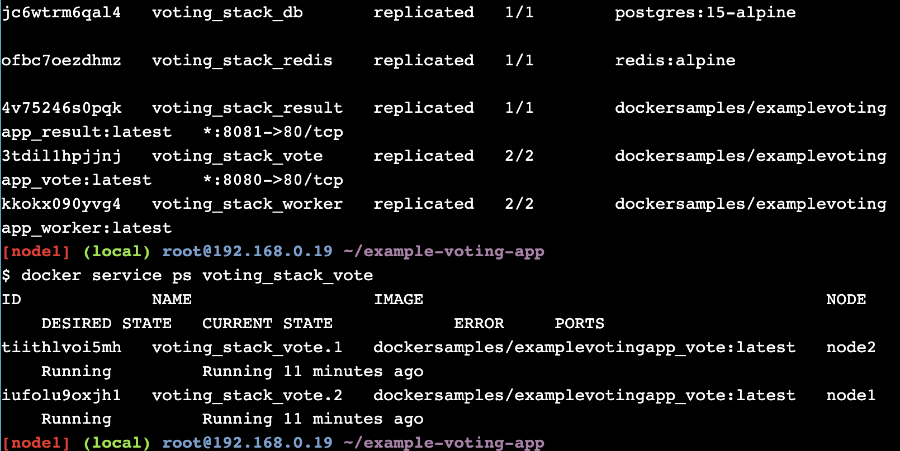

### Работающее приложени

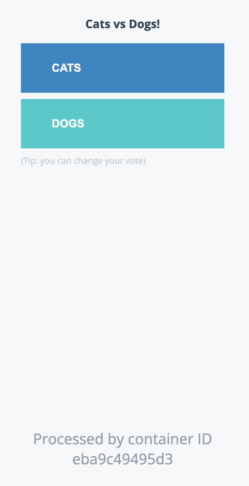